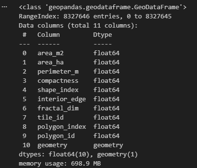
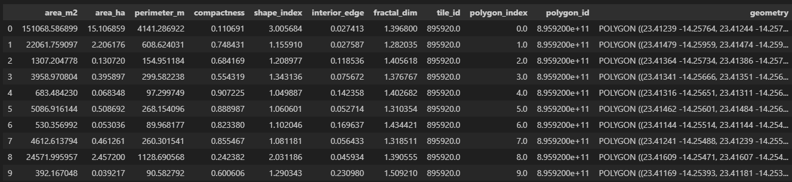
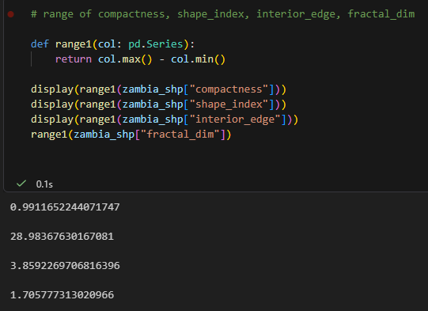
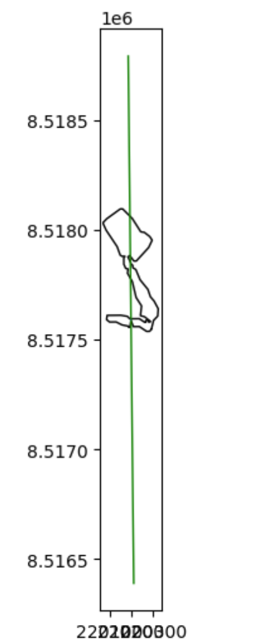
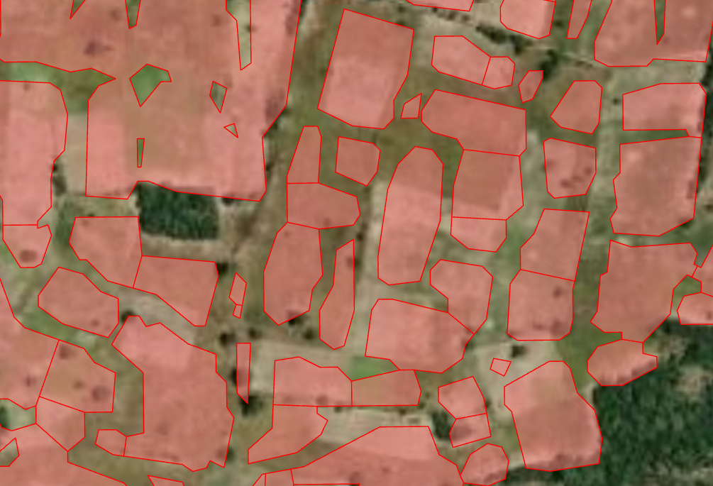
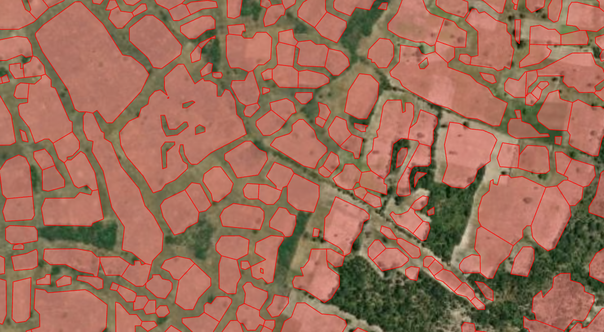
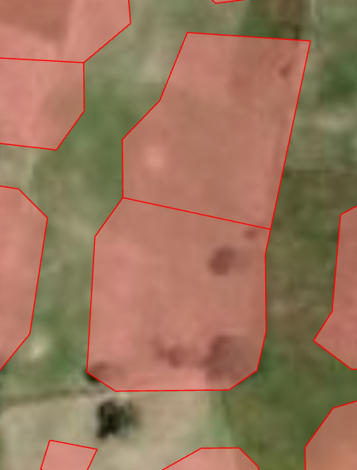
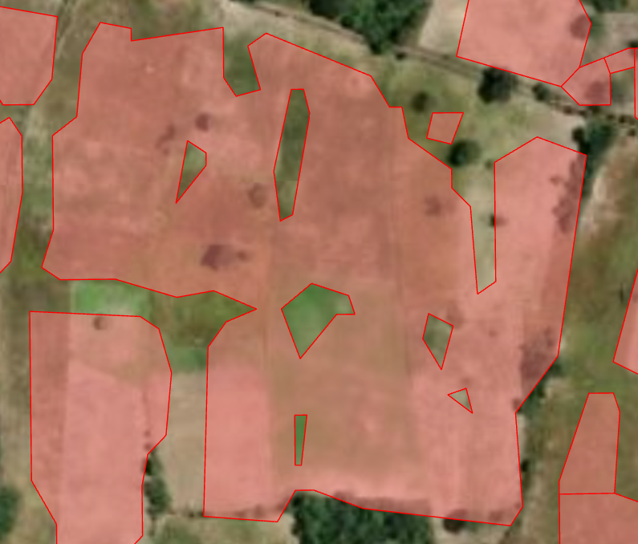

# cropfield-polygonization
Work related to crop field processing completed for ClarkU Fall26 Intro to Python Directed Study's Final Project. Completed by Solana Huang, Abrianna Culligan, and Zachary Yildiz-Raslan. 

# Notes on setup 
Zambia Cropfield Shape statistics file is ~1.9 G - please download locally only at this link: https://drive.google.com/file/d/1tV4HGXpFg4G5gmlLGe-6tGwlI0RTW4Ot/view

# Background
This work is based on Mapping Africa work completed by Prof. Lyndon Estes's AgroImpacts Research crop at Clark University. As part of their research, they have used CNNs to generate cropfield polygons across the entirety of states such as Zambia using high resolution Planet Imagery.
This project is  performed in parallel with other projects also attempting to create country wide large area field boundary maps, such as Fields of the World. 
Below is an example of the code used by Fields of the World to generate vector files from raster imagery: 
https://github.com/fieldsoftheworld/ftw-baselines/blob/main/ftw_tools/postprocess/polygonize.py

One challenge of this work is the creation of false "thin-necked" polygons and false "islands" within cropfield polygons. See example image below with false islands circled in red and thin necks connecting separate fields outlined in blue.

For our final project, we propose building upon this research by finding an algorithmic way to clean up these cropfield polygons. 

# Research Question
For our final project, we propose building upon this research by finding an algorithmic way to clean up these cropfield polygons. We hope to identify and fix (in order of priority): Thin necks connecting crop fields and false cutouts within crop fields. This entails splitting the polygons at the narrowest part of the neck and deleting all false cutouts. 

# Data Sources
Our primary data source for this project will be shape statistics generated for the state of Zambia using 2023 Planet Imagery generated using `src/instancemaker/computeinstances.py` in the instancemaker repo by Gregg Essuman ([computeinstances](https://github.com/agroimpacts/instancemaker/tree/main)), accessible in the `data` folder. This datasource contains the following shape descriptors: area (in m2 and ha), perimeter, compactness, shape index, interior edge, and fractal dimension. See image below for more details on data in this file. 

Compactness, or circularity, defines how “round” a cropfield polygon is, where low values indicate that a polygon is elongated. Shape index is the inverse square of compactness, where high values indicate that a polygon is elongated, and should be more sensitive to highly irregular shapes. Interior edge is the ratio of perimeter to area. Fractal dimension is another way to measure irregularity, where values close to 2 represent irregular shapes and values close to 1 represent very round, regular shapes. Tile ID, Polygon Index, and Polygon ID are unique identifiers for cropfield polygons. Geometry describes the geospatial location of the cropfield. Below are examples of the values seen for each of these shape statistic parameters.

Examining the range of values for compactness and fractal dimension in particular also shows that cropfield polygons in our dataset range from extremely irregular to very regular - the resulting ranges encompass almost the entirety of possible values. 

To visualize this further, see the first 100 rows of cropfield datasets symbolized by shape_index. Higher shape_index values correspond to more irregular shapes. 

# Proposed Methodology

## Topology
A possible first step in this project will be to establish a topology that can assess the dataset based on our defined rules. Mainly we want the topology to focus on the “thin necks” and false cutouts in the dataset, indexing these occurrences by severity of their deviation from our rules. The topology can also include name of rule violation and recommended fix for the incident. This topology could also create a point output with the index table joined for sharing with other RAs on the project. This  could be helpful in dividing portions of the validation process into manageable chunks. The following ESRI link provides a stand-alone python script template for topology creation and editing: [topology](https://pro.arcgis.com/en/pro-app/3.5/help/data/topologies/creating-a-topology.htm#:~:text=If%20you%20have%20data%20in,rules%2C%20and%20validates%20the%20topology).

## Area Weighted Sampling
To speed up computational processing and to make visualizing easier and faster, we can create an area-weighted sampling and validation process. We propose first splitting our entire dataset into tiles using the shapely module and then randomly sampling tiles from our split dataset, weighted by area to prioritize tiles with a large amount of cropland.
See “Splitting using a regular grid” in this source for sample code for splitting the dataset into tiles ([source](https://snorfalorpagus.net/blog/2016/03/13/splitting-large-polygons-for-faster-intersections/#:~:text=Splitting%20using%20a%20regular%20grid,position%20relative%20to%20the%20grid)). We can do this without the creation of a fishnet by leveraging the tileid assigned to each polygon. 

After splitting into tiles, we could sum the total area_m2 for polygons in each tile and create a column `total_area` that can be used as a weighting factor using `np.random.choice`, as in the example below ([source](https://stackoverflow.com/questions/43549515/weighted-random-sample-without-replacement-in-python)):

This would make visualizing easier by ensuring all polygons are in the same vicinity (easier to plot and verify) and also allow us to run our functions more quickly. 

## Possible Solutions for False Necks
Expanding upon previous work that refined the cropfield polygonization code and minimized false necks, one of our aims is to analyze confirmed false necks based on several spatial parameters and determine certain spatial rules or logic that the polygons in this project should follow to avoid having false necks. Some of these polygon parameters include perimeter and area, height and width, and so on. To find these rules/logic, we plan to filter (via shape statistic values) and apply the function to all polygons that qualify. For example, depending on the results of our analysis of samples, we might determine that no polygons can be smaller than x hectares, shorter than x meters, or longer than x meters. 

After filtering cropfield polygons, we would then run our thin neck identification and splitting function(s) on all remaining “irregular” polygons. One possible method for identification and splitting could be through an internal buffering method that creates buffers inside a polygon until the buffers are forced to split, and finds where the 2 split buffers are closest. 

It then finds the location on the original polygon that the buffer split corresponds to, and splits the polygon there ([source](https://gis.stackexchange.com/questions/333817/splitting-polygons-at-narrowest-part-using-r)). Sample code for this is written in R that would have to be translated to Python.

## Possible Solutions for Cut outs
One possible solution for the cut out problem is modeled off of gap-filling methods utilized for this ArcGIS project. Drawing from ‘The Neighborhood Similar Pixel (NSPI) Interpolation Method’ section, the goal is to create code that identifies islands or cut-outs within our sample study area. The code then analyzes whether these islands are “true” or “false” by examining its spatial neighbors. If all neighbors, or a certain proportion, are all polygons, then the code converts this “false” island into a polygon and merges it with the already existing neighborhood polygon(s).

Another possible solution could be to leverage the .interior and .exterior attributes created when using `shapely.Polygon` ([shapely.Polygon documentation](https://shapely.readthedocs.io/en/stable/reference/shapely.Polygon.html)). Interiors returns the sequence of interior rings of a polygon after a polygon is created and Exteriors returns the exterior ring of a polygon, so these attributes can be used to identify polygons with rings and then reconstruct them with only the exterior points. Another methodology using the shapely module could be to only remove interior polygons smaller than some threshold ([source](https://gis.stackexchange.com/questions/409340/removing-small-holes-from-the-polygon)): 

## Proposed Timeline 
| Week | Tasks | Assignee |
|------|-------|----------|
| 3/19 | - Clone original Mapping Africa repository and create accounts on Github to become collaborators   - Meet once this week to discuss next steps and the overall plan   - Review Gregg's statistics that he created for us | Solana = cloning |
| 3/26 | - Meet once this week  &nbsp;&nbsp;&nbsp;&nbsp;- Brainstorm 2-3 possible solutions to problems   - Consult the web on similar coding projects in Python or other programming languages | |
| 4/2 | - Submit project proposal to Zhiwen   - Meet once this week   - Continue researching similar projects and underlying concepts, test them   - Possibly schedule meeting with Lyndon or Gregg, depending on need   - Plan to write a small amount of code | |
| 4/9 | - Meet once this week w/Gregg  &nbsp;&nbsp;&nbsp;&nbsp;- Review pertinent shape statistics to inform code   - Each person will write a line of code and push it through GitHub for approval   - Review written code with Zhiwen during class | Solana = false necks + tile sampling function   Bri = false cutouts (Vector, Possibly raster)   Zac = expand on topology in raster |
| 4/16 | - Meet once this week   - Review written code with Zhiwen during class | |
| 4/23 | - Meet once this week   - Review written code with Zhiwen during class | |
| 4/30 | - Meet once this week   - Present final project to Zhiwen | |
| 5/5  | - Final deliverables due to John and Zhiwen | |

# Results 

## Thin Necks 

See `thinneck.ipynb` and `thinnecks.ipynb` for additional documentation and examples of the `poly_splitter` and `poly_splitter_recursive` functions. 

After implementing a "simple" case `poly_splitter` function in `poly.py` using guidelines described in the proposed methodology section, several challenges remained: 

1) For more complex shapes where there are multiple potential thin necks, how can we write a function that iterates through the dataframe several times to look for additional splits in new split polygons? How does this address the fact that geometries are in 3 columns (the original `geometry` column, the `cut_geom1` column, and the `cut_geom2` column)?

To address this, we created a recursive version of the original `poly_splitter` function that recurses through the original dataframe and looks at the split columns. These split columns are combined into the original dataframe with unsplit polygons and their original geometries are removed. The `poly_splitter` function keeps on running on this updated geodataframe. 

2) What parameters can we use to fine tune the line used to `split` polygons? Investigations of polygons in preliminary split datasets show that some cut lines intersect polygons at a point and cannot split properly. Other lines are too long and cause false small splits, or what we call `slivers`. See images below. 

  

To address this, we created a horizontal and vertical unit vector (distance in the x and y directions over total length) for the distance between the two closest points of the multipolygons created at the point the inward buffer splits. See lines 76-80 in `poly.py`. This becomes a unique factor that we can multiply by `dist` (which is defined by the bounds of the polygon divided by 4) to extend the split line while maintaining the perpendicular slope. Although this worked well for the `test_tile` used for this study, the efficacy of the `dist` parameter likely needs to be verified over a larger dataset. 

In the case that there are unnecessary splits, we added a for loop in the `poly_splitter` function that merges a sliver (a polygon in the scenario that there are more than 2 cut polygons after a split where the polygon is not one of the 2 largest polygons) with one of the 2 largest polygons either based on a shared edge or closest distance if there is no shared edge (lines 101-120). 

In the case that a split "fails", especially where one side of the line intersects the polygon at a point, we snapped the split line to the polygon and added a larger tolerance of 1 meter which may need to be adjusted (lines 87-88). 

Verification of the generated polygons through the final versions of the `poly_splitter` and `poly_splitter_recursive` functions show many successful splits, especially at very thin necks, that appear to be supported by satellite imagery. Below is a sample of that output from `test_tile` overlaid over ArcGISPro 2024 basemap World Imagery. 

# Conclusions

This project was a informative way to learn how to deal with large datasets and the unique challenges of geospatial datasets. As a team, we were able to develop algorithmic ways to address common cropfield polygon issues, although further work needs to be done through the framework established in this project. 

Regarding the thin neck problem in particular, we were able to successfully generate several functions that are capable of iterating through vector datasets and returning split functions with minimal issues. That being said, the method used by this study is not very efficient. It took around 25 minutes to run `poly_splitter_recursive` on `test_tile`, which was a GeoDataframe of 1979 rows and 11 columns. Discussions with Zhiwen alluded to future work that can focus on how to make this less computationally intensive - maybe through binary searches, simplifying geometry, adjusting the parameters such as `max_iter`, `dist`, and `delta`, or adding a minimum buffer length in addition to the maximum so that "thicker" polygon necks are not split. For an example of "thick" polygon necks that may not need to be split, see below: 

Another issue that we noticed is that this approach is not very successfully at splitting polygons with what we call "false cut outs", as the distance between many of these cut outs and the polygon exterior are considered thin necks. As we generated a framework for deleting "false cut outs" in this project as well, we recommend running that on a dataset first before running the `poly_splitter_recursive` function.  

## Zachary Yildiz-Raslan Result/Discussion
Notes and resource references are all included in my .pyt script merged from ZYR Branch

My first step was to create a topology to try and address these issues within ArcGIS Pro. Using a topology template provided by ESRI (https://pro.arcgis.com/en/pro-app/latest/help/data/topologies/creating-a-topology.htm), I begain to customize the script based on specifics of the project. I was hoping to utilize pre-made topology rules to index and address holes in polygons, however the closest pre-made tool for this problem was the "must not have gaps" rule. This would address the polygon holes, but would also catch any gaps between the features as errors as well, which is not what we want to index. In the end, I decided to use the "Must not overlap" rule to address polygon features overlapping themselves. In the sample project area which I exported, this particular issue was not found. So I created a test polygon that did overlap with another polygon to test that the topology was validating correctly. This was to test that the topology was set up and validating correctly. Future work on this would involve customizing a rule based on indexing polygon holes.

The first post-processing section was targeting small islands. This was straight forward and coule easily be done in ArcGIS Pro using attribute query. However, as an exercise in python scripting using ArcPy, I created a selection of polygons that were under 300 square meters (based on the projection of the polygon data that I set in ArcGIS Pro), and copied these features into a new feature class and layer. 

The second post-processing section was targeting polygon holes. This was more complex and the logic for this approach was gleaned from a post on GIS Stack Exchange (https://gis.stackexchange.com/questions/27255/how-to-identify-feature-vertices-that-are-part-of-a-donut-hole-in-arcgis-10). Essentially, this process starts by creating nested for loops that itterate through "parts" of each polygon to create arrays of vertices along the rings. These rings were split by the None seperator, and stored in a list. If the list "Rings" has more than one "ring" then this polygon has holes to be indexed and appended to the output feature class and layer. The last portion of the script is a for loop that selects "rings" lists that have more than one "ring", and starting with the second "ring" in the list, appends these ring geomtries to the new "holes" output feature class. This is a method to identify polygon holes and create an output feature class of these holes. The output will include shape_area and shape_len, which can be used to sort the table based on hole size. Running this script in ArcGIS Pro Python window produces a scratch .gdb, a Holes feautre class, Holes layer, small polygons feature class, and topolgoy feature class in your .gdb feature dataset (paths will need to be updated based on each user's specifications). This output can be used in a human-based QA/QC process to review whether these holes are valid or not, as well as a feature that can used to quickly merge and "plug" these polygon holes if they are not invalid. 