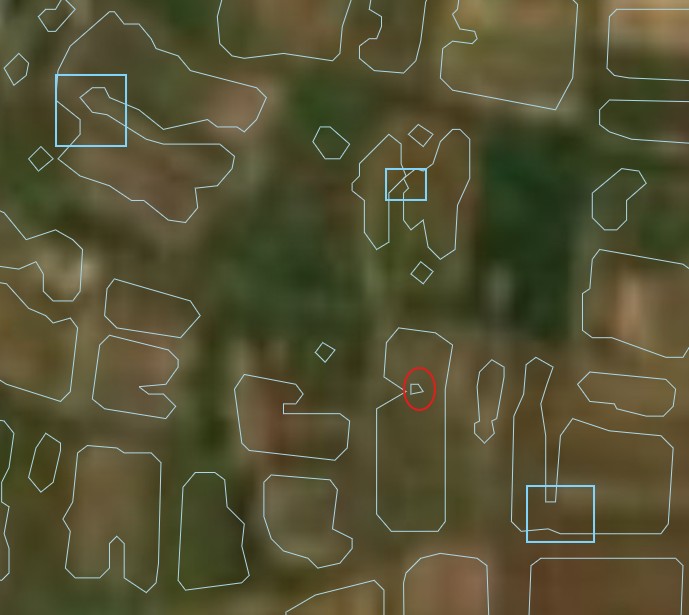

# cropfield-polygonization
Work related to crop field processing completed for ClarkU Fall26 Intro to Python Directed Study and Mapping Africa projects

# Notes on setup 
Zambia Cropfield Shape statistics file is ~1.9 G - please download locally only at this link: https://drive.google.com/file/d/1tV4HGXpFg4G5gmlLGe-6tGwlI0RTW4Ot/view

# Background
This work is based on Mapping Africa work completed by Prof. Lyndon Estes's AgroImpacts Research crop at Clark University. As part of their research, they have used CNNs to generate cropfield polygons across the entirety of states such as Zambia using high resolution Planet Imagery.
This project is  performed in parallel with other projects also attempting to create country wide large area field boundary maps, such as Fields of the World. 
Below is an example of the code used by Fields of the World to generate vector files from raster imagery: 
https://github.com/fieldsoftheworld/ftw-baselines/blob/main/ftw_tools/postprocess/polygonize.py

One challenge of this work is the creation of false "thin-necked" polygons and false "islands" within cropfield polygons. See example image below with false islands circled in red and thin necks connecting separate fields outlined in blue.

For our final project, we propose building upon this research by finding an algorithmic way to clean up these cropfield polygons. 

# Proposed Methodology
We hope to build upon existing Mapping Africa code that calculates shape statistics for polygons and saves new GeoJSON files with additional information. Examples of metrics included: area, compactness, interior_edge (perimeter to area ratio), fractal_dim. 
https://github.com/agroimpacts/instancemaker/blob/main/src/instancemaker/computeinstances.py

Using these statistics, we can isolate polygons with "thin necks" and split them along these locations. Below is an example of a similar problem being approached with buffers in R that we can use to guide our project.
https://gis.stackexchange.com/questions/333817/splitting-polygons-at-narrowest-part-using-r

Other possible functions we can generate for this project include a sampling function that is weighted by parameters such as cropfield area. After creating a representative sampling of tiles in Zambia, we can then run our algorithm on the sampled tiles. This could save time and computational resources.

We can also generate an function that differences the original polygons from our newly generate polygons to see the change in cropland area after processing is applied. 

** I think zac had another function he was interested in?** 

During our meeting with Lyndon, I recall he was interested in my topology development suggestion for this data using python. He seemed less interested in the idea I had based on a similar project I was apart of during my undergrad because this project has already covered that aspect, and is now in more of a QA phase. The topology would be successful if it were able to identify and index (mapped with a point only, for now) areas of known issues (such as "thin necks" and the other common error he mentioned which I can't recall now), and recommend operations for rectification. I think developing a script that defines and implements this topology would be a strong first step for a tool that automates spatial fixes in the existing dataset (or new one). The spatial stats that Gregg exported for us could be a great sample set to build and test this topology on. If we are able to complete the topology (which itself will be a considerable task, I think), then we move on to creating spatial outputs that rectify the issues? Does this make sense?

I apologize again for missing our second group meeting, I would have added this to our discussion. Let's discuss tomorrow during class time(?) with Zhiwen, luckily I don't think there is a rigid timeline for us to adhere to for this project, as long as we work on something that is meaningful for us and hopefully contributes to Lyndon's research.

## Proposed Timeline (Bri) 
test 123

